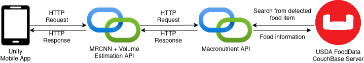

# ByteMi Macronutrient API

This API uses the USDA's FoodData central as its data source in JSON format

The JSON dataset are then stored at CouchBase that allows us to use full text searching without hurting performance

## System Architecture

The system has three parts:
1. The mobile app frontend - written in C# using Unity to take advantage of the ARFoundation framework (ARCore Depth API)
2. The Mask-RCNN + Volume Estimation API - responsible for segmenting, and recognizing the food items which are then passed to the Volume Estimation API for retrieving the volumes of each food item
3. Macronutrient API - after receiving the recognized food item and their volumes, this service will handle the retrieval of macronutrient details from the database

## System Components

1. [Mobile App Frontend](https://github.com/prLorence/bytemi-depth)
2. [Mask-RCNN + Volume Estimation API](https://github.com/prLorence/integrated_byte_mi)
3. Macronutrient API (you're here)
